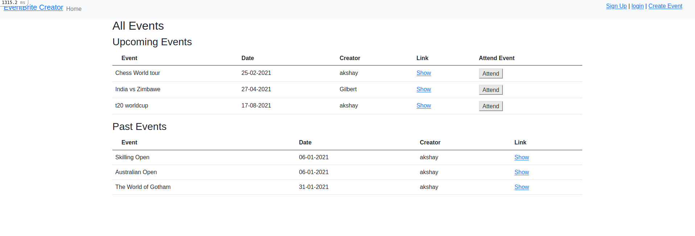
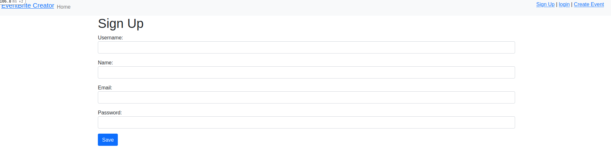
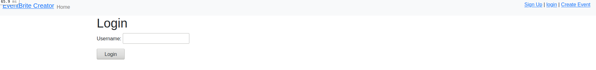
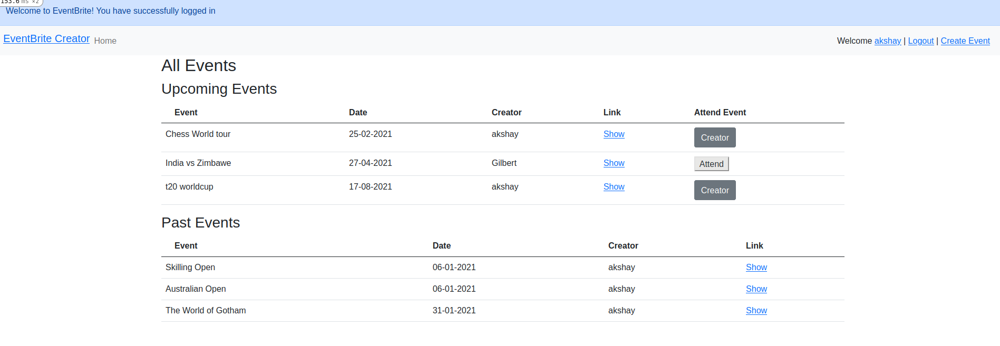

# Private Events

### Build a webapp using Rails to create Events and replicate the Eventbrite website's functionality

#### Without logging in

> 

#### Sign Up

> 

#### Login

> 

#### When logged in

> 

## Built With

- Ruby
- Rails

### Prerequisites

- Text Editor (VSCode is suggested.)
- Ruby
- Rails
- Yarn

## Getting Started

To get a local copy up and running follow these simple example steps:

- Fork this project
- Open your terminal
- Clone this project `https://github.com/ggotora/private-events.git`
- Go to the project folder `cd private-events`

### Install

- Run `bundle install`
- Create the database `rails db:create`
- Migrate the database `rails db:migrate`

### Run tests

- Run `rails generate rspec:install`
- Run `rspec`

## Authors

👤 **Author1**

- GitHub: [@ggotora](https://github.com/ggotora)
- Twitter: [Gotora Gilbert](https://www.twitter.com/gotora_gilbert)

👤 **Author2**

- Github: [@akshay-narkar](https://github.com/akshay-narkar)
- Twitter: [Akshay](https://www.twitter.com/akidoit)

## 🤝 Contributing

Contributions, issues and feature requests are welcome! Start by:

- Forking the project
- Cloning the project to your local machine
- `cd` into the project directory
- Run `git checkout -b your-branch-name`
- Make your contributions
- Push your branch up to your forked repository
- Open a Pull Request with a detailed description to the development branch of the original project for a review

## Show your support

Give a ⭐️ if you like this project!

## Acknowledgments

- Thanks to Odin project for the tutorials.

## 📝 License

This project is [MIT](LICENSE) licensed.
